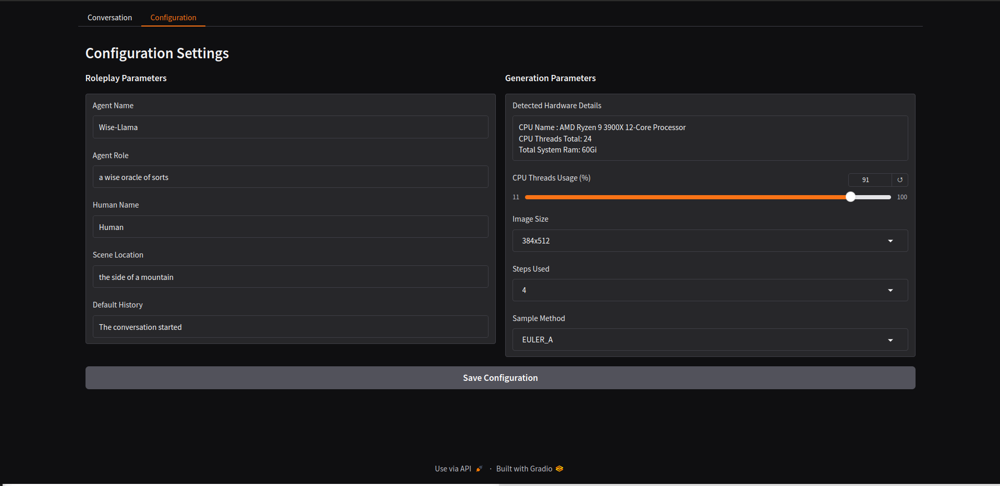

# Chat-Linux-Gguf (was Chat-Ubuntu-Gguf)
- Status: Working, still early development.
- Note: This readme.md is between versions.

### Description
Its a lightweight Chatbot native to Linux, that uses Gguf models to simulate conversations with contextual awareness in a Gradio interface in your Web-Browser. The idea is its a framework able to be customised to adapt the model interference to any task or purpose, for example, personal manager, email responder, etc. Still being created, tba. In v1.00, there was, 4 Python and 1 Bash, scripts, enabling editing with the maximum of 5 files (excluding prompts) upload in claude_sonnet for free account, thus, able to be modified in AI with files by anyone; progressing past v1.00, more complexity is added, so less focus on limiting script numbers, in an attempt to avoid, complexity and code loss.

### FEATURES
- Gguf Models: Using, Gguf-Parser and accompanying json files; auto-configuration of model parameters. 
- Gradio Interface: A browser-based interactive interface tied seamlessly into terminal operations.
- Integrated Setup and Operation: Through a single Bash launcher script that manages installation, execution, and cleanup.
- Folder and File Management: Automated handling of configuration files, logs, and persistent data (YAML-based).
- 2 Prompt rotation for, conversation and consolidation, producing context aware conversation.
- Modularity: Python scripts are designed to work together with clear roles (e.g., model handling, interface logic).
- Persistence: Session data, settings, and configurations are retained across restarts.

### Preview
- The Conversation Page...


- The Configuration Page...



- The Installer/Launcher...
```
================================================================================
    Chat-Ubuntu-Gguf - Bash Menu
================================================================================


    1. Launch Main Program

    2. Run Setup-Installer


--------------------------------------------------------------------------------
Selection; Menu Options = 1-2, Exit Program = X: 

```

### Requirements
- Linux OS - Personally using Ubuntu 24.10, likely other Linux work.
- Python - Python is installed to `./VENV` does not affect system.
- LLMs - GGUF format Large Language Models, it will detect parameters.
- CPU - Tested on AMD x3900 CPU, llama-cpp-python supports others.
- Internet - Libraries and Compile stuff, will install from web.  

### Usage
Instructions are for upcoming GPU enhanced version...
1. Download the release, and then unpack to a sensible folder somewhere, then open a terminal in that folder.
1. In the terminal run the command "sudo ./Chat-Linux-Gguf.sh" in terminal in the program folder, and ensure the files are executable if there is immediate issue.
2. the Installer/Launcher runs, and you should select `2` to, install requirements and setup files/folders.
3. If you've multiple, GPUs and brands, a GPU menu will appear, select the GPU brand you intend to use.
3. After install completes, insert your `*.gguf` to the newly created folder `./models` (settings auto-detect).
4. You should then select `1` from the menu to launch the main program, and a browser window should pop-up, but in failing that then right click on `http://127.0.0.1:7860` and then left click `Open Link` to do the same.
5. You will then be interacting with the browser interface, where the buttons do what you would expect, but ensure to take a quick look at the "Configuration" tab first.
6. After finishing your session, then click on `Exit Program` in the browser window, and then the terminal will return to the Bash menu, and then select `X` to exit correctly. 

### Example Prompts
1) "Hello there! I never thought I would see you here on the mountain..."
2) "Wow, I bet you can actually talk? A talking llama, I'll be rich!"
3) "You look knowledgeable, do you have wise thoughts and think wise things?"
4) "Tell me, Wise-Llama, what is humanity's purpose, and dont tell me 42!"

### Notation
- Current, testing and advised, model(s): `https://huggingface.co/MaziyarPanahi/Llama-3.1-8B-Lexi-Uncensored-V2-GGUF`.

### Development
The current plan for work is...
1. GPU Selection in Bash, then install appropriate libraries, and then in main program, configuration and use, of GPU and/or CPU, depending upon the assigment of Layers in the configuration.
1. Optimize for Less Overall Characters, more advanced programming. 
2. Re-Structure Code/Scripts, ensure code is, appropriately and optimally, located in correctly themed/labeled script(s).
2. Test and Bugfix, all options and features, soes everything still works.
5. work on expansion of features, this will require a list of wanted features, then break down to, least code and best advantage, to round off features.

### File Structure
- Initial File Structure...
```
./
├── Chat-Linux-Gguf.sh        # Main Bash launcher script
├── main_script.py             # Entry point script
├── requirements.txt           # Dependencies for the virtual environment
├── prompts/
│   ├── consolidate.txt        # Prompt template for consolidation tasks
│   ├── converse.txt           # Prompt template for conversation tasks
├── scripts/
│   ├── interface.py           # Gradio interface logic
│   ├── model.py               # GGUF model handling and interaction
│   ├── utility.py             # Utility functions
└── LICENSE.txt                # License file for the project
```
- Files Created by Installation...
```
./
├── data/
│   ├── temporary.py           # Holds ALL global variables
│   ├── __init__.py            # to mark the directory as a Python package
│   ├── persistent.yaml        # Holds default Chatbot configuration
├── venv/                      # Venv local install folder avoiding system conflict.
│   ├── *                      # Various libraries installed from `./requirements.txt`.
├── logs/                      # (Empty) Will contain any produced log files.
├── models/                    # (Empty) Directory for, `*.GGUF` and `model_config.json` ,files
```

## DISCLAIMER:
- It is advided not to run the scripts in Alpha stage, or unexpected results may occur.
- Refer to License.Txt for terms covering usage, distribution, and modifications.
